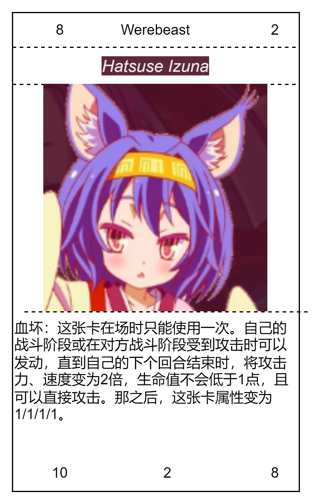

## 卡牌
cost=祭品+Argon
其中祭品需要特殊讲解一下，首先同种族作为祭品时有加1计数，其次祭品的cost会增加等量计数。
如想要召唤cost为2的卡牌，可以
1. 献祭两只cost为0的其他种族卡牌
2. 献祭1只cost为0的同种族卡牌
3. 不献祭改为支付2点Argon
4. 献祭一只cost为0的其他种族卡牌并支付一点Argon
5. 献祭一只cost为1的其他种族卡牌

法术牌与其类似，但是献祭怪兽时始终视为其他种族卡牌

### 通常陷阱
1. 陷阱卡必须要盖伏后经过至少一个结束阶段才能使用

巫女的眼镜 cost 0
当对方使用魔法卡时，使其无效并破坏
   
茫酥酥炸弹 cost 0 回复 2
1. 这张卡不在场上存在[love or loved]的情况下不能使用
2. 选择一个没有卡存在的格子，使其无法使用

火烧 cost 0 回复1
选择对方场上的一张魔法卡，使其无效并破坏
### 场地魔法
1. 法术牌的一种
2. 一方的场地魔法同时只能存在一张，同一玩家使用的第二张场地魔法会使第一张送去墓地
3. 使用后会一直停留在场上，送去墓地时失去效果
4. 场地魔法有标注的范围，某些效果仅在范围内有效

东部联合 场地魔法 范围5x2
cost 1 
1. 作为本卡使用时的处理，从卡组将一张兽人种的怪兽加入手卡
2. 范围内的兽人种怪兽获得+1A/+1H
3. 一回合一次，在战斗阶段中，自己的兽人种怪兽因战斗而被破坏时，选择对方场上一张卡破坏
   
### 环境魔法
1. 法术牌的一种
2. 环境魔法同时只能存在一张，任意玩家使用的第二张环境魔法会使第一张送去墓地
3. 使用后会一直停留在场上，送去墓地时失去效果

Love or Loved cost 2 环境魔法
双方玩家不能使用魔法，与[love or loved]相关的魔法除外

The rain falls（烟雨锁城） 2 环境魔法
降下大雨，双方怪兽的攻击力、速度、射程变为原本的1/2（向下取整），在召唤的第一回合不能进行战斗，射程变为0的怪兽不能进行战斗

### 装备魔法
1. 法术牌的一种
2. 使用后会一直停留在场上并指向装备，送去墓地时失去效果
3. 装备者被送去墓地时也会一并送去墓地

血斧 cost 2  
1. 只能给兽人种怪兽装备
2. 装备怪兽获得+2A，在一个战斗阶段中可以攻击两次

茫酥酥枪 cost 1
1. 装备怪兽获得+2R
2. 这张卡不在场上存在[love or loved]的情况下不能使用
3. 装备者对对方怪兽使用的攻击改为获得其控制权
   

### 永续魔法
1. 法术牌的一种
2. 使用后会一直停留在场上，送去墓地时失去效果

爱之NPC cost 1
1. 这张卡不在场上存在[love or loved]的情况下不能使用
2. 一回合一次，在自己的主要阶段；在自己场上特殊召唤2只c0/r1/a1/s1/h1的兽人衍生物
   
无限弹跳 cost 2
1. 这张卡不在场上存在[love or loved]的情况下不能使用
2. 自己的兽人种怪兽在战斗阶段可以进行等同于射程的攻击次数
### 通常魔法
保家卫国 cost 0 通常魔法
从卡组将一张场地魔法加入手卡

Argon心 cost 0 通常魔法
在这个回合中，获得两点Argon

强欲之赐 cost 1 通常魔法
抽两张卡

二次机会 cost 0
在这个回合中，获得一次额外的召唤机会

扩张 cost 0
使[东部联合]的范围扩大为5x3，若其范围已经为5x3，则改为获得一个额外的战斗阶段

第六感 cost 1
在自己的下一个回合，获得3点Argon，若[东部联合]的范围已经为5x3，则改为获得4点

张开弹幕 cost 2
1. 这张卡不在场上存在[love or loved]的情况下不能使用
2. 选择一片3x1的区域，破坏其中所有怪兽

撤离 cost 0 #
将[东部联合]送去墓地；使所有兽人种怪兽返回持有者手卡，并获得等同于其控制范围数量-5的Argon

坐巫雁 cost 2 #
这张卡只能在主要阶段1的最开始使用
1. 从卡组特殊召唤一只cost为4以下的兽人族怪兽，那之后，这个回合不能进入战斗阶段，不能召唤、特殊召唤怪兽

瞬移 cost 0 回复1
选择场上一只怪兽；将其移动到另一个没有怪兽存在的格子上

抚摸 cost 0 回复1
选择对方场上的一只怪兽；对其造成3点伤害

开垦 cost 0 回复2
选择自己场上的一张兽人种怪兽；使其恢复3点血量

### 兽人种Werebeast

Hatsuse Izuna
cost 5 兽人种 r2/a10/s2/h8
1. 血坏：这张卡在场上存在期间只有一次，自己的战斗阶段活在对方战斗阶段受到攻击时；直到那个战斗阶段结束时，将攻击、速度变为2倍，不会被战斗破坏。那之后，这张卡的属性变为r1/a1/s1/h1。

兽人A
cost 0 兽人种 r1/a2/s1/h2
[普通的兽人]

Miko cost 4 兽人种 r3/a5/s2/h5
1. 当该卡召唤、特殊召唤成功时，从卡组将一张[东部联合]加入手卡
2. 血坏
3. 当此卡在场时，会使[东部联合]的范围扩大为5x3，对方的场地魔法无效

Hatsuse Ino 3 兽人种 r1/a4/s1/h4
1. 当该卡召唤、特殊召唤成功时，在自己场上特殊召唤2只c0/r1/a1/s1/h1的兽人衍生物
2. 血坏

诺一慢 cost 1 兽人种 r1/a2/s1/h1
1. 当该卡召唤、特殊召唤成功时，从卡组将一张[Love or Loved]或记述有[Love or Loved]的卡加入手卡
2. 一回合一次，当[东部联合]范围为5x3时，使用的下一场魔法卡无需Argon

前线指挥官 cost 2 兽人种 r1/a4/s1/h4
1. 当该卡通过战斗破坏对方怪兽时，使[东部联合]获得5x3的范围
2. 一回合一次，当[东部联合]范围为5x3时，从手卡特殊召唤一个兽人种怪兽

兽耳娘B
cost 0 兽人种 r1/a1/s1/h1
这张卡作为兽人种召唤的献祭素材时，可以额外提供2点cost计数

农业兽人C cost 2 兽人种 r1/a4/s1/h4
1. 有[东部联合]在场时，使己方全体兽人种获得+1A/+1H，若其范围为5x3，则再获得+1/+1/+1/+1

工业兽人D cost 2 兽人种 r1/a5/s1/h3
1. 当该卡召唤、特殊召唤成功时，若有[东部联合]在场，则从卡组将一张兽人种的魔法卡加入手卡，若其范围为5x3，则再抽一张卡

科技兽人E cost 2 兽人种 r1/a3/s1/h5
1. 当该卡召唤、特殊召唤成功时，若有[东部联合]在场，则从卡组将一张兽人种的陷阱卡加入手卡，若其范围为5x3，则再对对方玩家造成5点伤害

兽人F
cost 1 兽人种 r1/a3/s2/h3
[一般的兽人]

兽人G
cost 2 兽人种 r2/a4/s2/h4
[强力的兽人]

兽人H
cost 3 兽人种 r2/a6/s3/h7
[精英的兽人]

兽人I
cost 4 兽人种 r3/a6/s3/h7
[生育的兽人]

### 互帮互助
icelike2 cost 1 人类种 r1/a1/s1/h1
1. 当这张卡召唤、特殊召唤成功时，从卡组将一张属于[互帮互助]的卡加入手卡

sigdcausdg cost 2 人类种 r1/a2/s1/h2
1. 对方的战斗阶段开始时，把这张卡从手卡、场上送去墓地才能使用，对方的战斗阶段结束

kuroko cost 3 人类种 r1/a3/s1/h3
1. 当这张卡召唤、特殊召唤成功时，从卡组把一张[烟雨锁城]使用

cabbage cost 4 人类种 r1/a4/s1/h4
1. 当这张卡召唤、特殊召唤成功时，从墓地将cost计数小于这张卡的属于[互帮互助]的怪兽尽可能地在自己的场上特殊召唤

conioer cost 5 人类种 r1/a5/s1/h5
1. 当场上有属于[互帮互助]的怪兽存在时，这张卡可以从手卡特殊召唤

whynomusic cost 6 人类种 r1/a6/s1/h6
1. 这张卡不能进行战斗
2. 战斗阶段才能使用，选周围1格内的怪兽破坏并移动到那一格，这个效果一回合可以使用等同于这张卡速度的次数
3. 当这张卡因效果2破坏怪兽时，获得1点速度

abo cost 7 人类种 r1/a7/s1/h7
1. 这张卡可以召唤到棋盘上任意位置
2. 这张卡可以作为0cost的永续魔法使用到棋盘任意位置
3. 这张卡作为永续魔法时，己方结束阶段，对对方造成7点伤害

